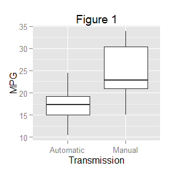
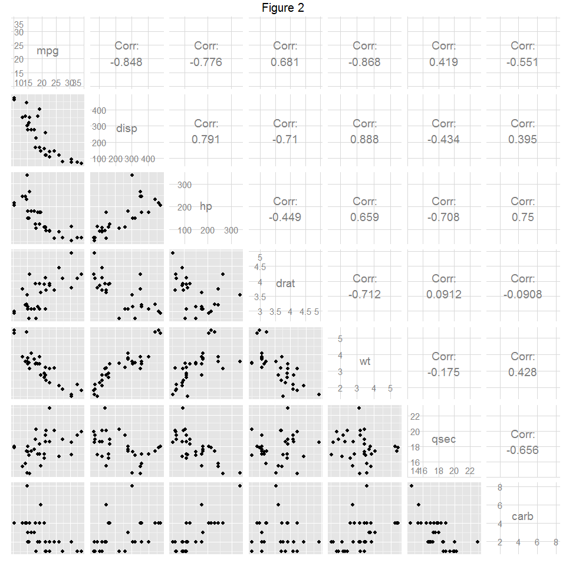
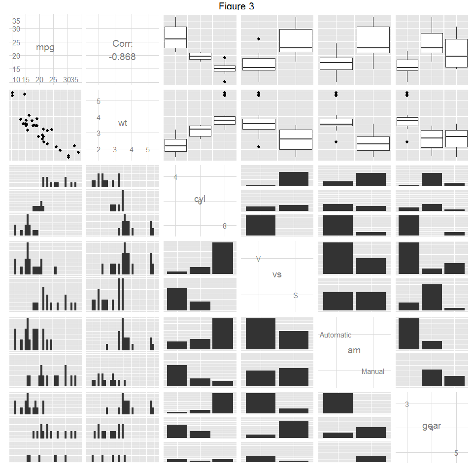
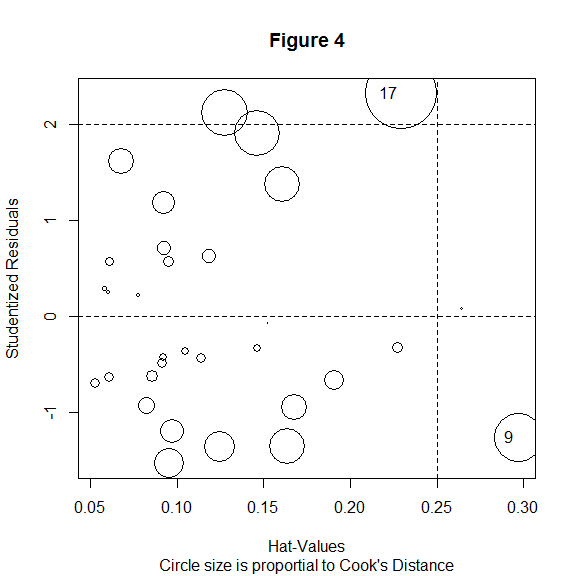

# Course Project for Regression Models

## Executive Summary

The dataset `mtcars` contains data on fuel consumption and ten aspects of automobile design and performance for 32 automobiles (1973--74 models). Linear regression analysis shows that automatic transmission vehicles from that year had worse gas mileage than manual tramission vehicles. After controlling for other factors (like weight, for example) that are also related to fuel efficiency, MPG is still lower for automatic transmission vehicles, but not by a substantial margin.

(Note: due to the brevity of this report, I will not echo any R code.)


## Exploratory data analysis

To begin with, the simplest analysis is just to compare the center and spread for MPG among automatic transmission vehicles to that of manual transmission vehicles. Figure 1 in the Appendix shows a boxplot in which it is evident that MPG is lower for cars with automatic transmission.

We will also be interested in associations between the variables. It seems likely, _a priori_, that many of the measurements will be correlated with MPG and with each other. There are two plots in the Appendix (Figures 2 and 3) that show these relationships, one for the collection of quantitative variables and the other relating MPG to the categorical variables. Because weight is seen to be highly correlated to many other variables, it is also included in Figure 3. (Note: With a sample size of 32, correlations are statistically signficant when $|r| > 0.349$.) MPG appears to be associated with everything. Among the covariates, weight is most strongly correlated with MPG and with just about everything else, except qsec, the quarter-mile time.

## Regression modeling

### mpg ~ am

The simplest linear model compares transmission to MPG directly. This is just one-way ANOVA with two categories, which is mathematically equivalent to an independent samples t-test. ($F = t^2$)


```
## (Intercept)    amManual 
##      17.147       7.245
```

This simply says that the mean MPG for cars with automatic transmission is 17.1474 and that the mean MPG for manual transmission cars is 7.2449 more.

### mpg ~ am + wt + qsec

Since weight is highly correlated with mpg, we add it into the model. However, since everything else is highly correlated with weight and mpg, we would have a problem with multicollinearity if we included much more. The only additional variable that seems to give much extra predictive power to the model is qsec, which makes sense because qsec was largely uncorrelated to weight, but still somewhat correlated to mpg.


```
## 
## Call:
## lm(formula = mpg ~ am + wt + qsec, data = mtcars2)
## 
## Residuals:
##    Min     1Q Median     3Q    Max 
## -3.481 -1.556 -0.726  1.411  4.661 
## 
## Coefficients:
##             Estimate Std. Error t value Pr(>|t|)    
## (Intercept)    9.618      6.960    1.38  0.17792    
## amManual       2.936      1.411    2.08  0.04672 *  
## wt            -3.917      0.711   -5.51    7e-06 ***
## qsec           1.226      0.289    4.25  0.00022 ***
## ---
## Signif. codes:  0 '***' 0.001 '**' 0.01 '*' 0.05 '.' 0.1 ' ' 1
## 
## Residual standard error: 2.46 on 28 degrees of freedom
## Multiple R-squared:  0.85,	Adjusted R-squared:  0.834 
## F-statistic: 52.7 on 3 and 28 DF,  p-value: 1.21e-11
```

So controlling for weight and quarter-mile time, we see that manual trasmission is still predicted to increase MPG by about 3. Of course, this difference may be statistically significant, but not of much practical significance.

Probably, the most helpful diagnostic plot is given by the `influencePlot` command in the `car` package. Figure 4 in the Appendix shows in one plot the studentized residuals, hat values to measure leverage, and Cook's distance to measure influence. The model is not perfect: while the data is relatively homoscedastic, the 9th data point (the Merc 230) has high leverage and some influence, and the 17th data point (the Chrysler Imperial) is not quite as high leverage, but exerts even more influence. In neither case, though, does the Cook's distance exceed 0.5.

Although I believe that stepwise regression is evil, it is gratifying that a bidirectional stepwise regression algorithm (`stepAIC` from the `MASS` package) produces this very model.

## Appendix

 

 

 

 

```
##    StudRes    Hat  CookD
## 9   -1.251 0.2970 0.4026
## 17   2.323 0.2296 0.5896
```
