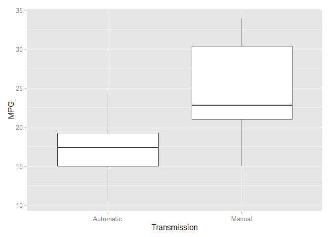

# regmods-006_project


```r
library("dplyr")
library("ggplot2")
```

Convert factor variables.

```r
mtcars <- mtcars %>%
    mutate(cyl = factor(cyl),
           vs = factor(vs, levels = c(0, 1), labels = c("V", "S")),
           am = factor(am, levels = c(0, 1), labels = c("Automatic", "Manual")))
```

Basic summary:

```r
mpg_by_am <- mtcars %>%
    group_by(am) %>%
    summarize(mean(mpg), sd(mpg))
mpg_by_am
```

```
## Source: local data frame [2 x 3]
## 
##          am mean(mpg) sd(mpg)
## 1 Automatic     17.15   3.834
## 2    Manual     24.39   6.167
```

```r
ggplot(data = mtcars, aes(x = am, y = mpg)) +
    geom_boxplot() +
    xlab("Transmission") +
    ylab("MPG")
```

 

Linear model for mpg ~ am. (This is just one-way ANOVA.)

```r
fit1 <- lm(mpg~ am, data = mtcars)
summary(fit1)
```

```
## 
## Call:
## lm(formula = mpg ~ am, data = mtcars)
## 
## Residuals:
##    Min     1Q Median     3Q    Max 
## -9.392 -3.092 -0.297  3.244  9.508 
## 
## Coefficients:
##             Estimate Std. Error t value Pr(>|t|)    
## (Intercept)    17.15       1.12   15.25  1.1e-15 ***
## amManual        7.24       1.76    4.11  0.00029 ***
## ---
## Signif. codes:  0 '***' 0.001 '**' 0.01 '*' 0.05 '.' 0.1 ' ' 1
## 
## Residual standard error: 4.9 on 30 degrees of freedom
## Multiple R-squared:  0.36,	Adjusted R-squared:  0.338 
## F-statistic: 16.9 on 1 and 30 DF,  p-value: 0.000285
```

```r
anova1 <- anova(fit1)
anova1
```

```
## Analysis of Variance Table
## 
## Response: mpg
##           Df Sum Sq Mean Sq F value  Pr(>F)    
## am         1    405     405    16.9 0.00029 ***
## Residuals 30    721      24                    
## ---
## Signif. codes:  0 '***' 0.001 '**' 0.01 '*' 0.05 '.' 0.1 ' ' 1
```
Equivalent to a two-sample t-test with equal variances assumed. ($F = t^{2}$.)

```r
fit_t1 <- t.test(mpg ~ am, var.equal = TRUE, data = mtcars)
fit_t1
```

```
## 
## 	Two Sample t-test
## 
## data:  mpg by am
## t = -4.106, df = 30, p-value = 0.000285
## alternative hypothesis: true difference in means is not equal to 0
## 95 percent confidence interval:
##  -10.848  -3.642
## sample estimates:
## mean in group Automatic    mean in group Manual 
##                   17.15                   24.39
```

```r
all.equal(anova1$F[1], (fit_t1$statistic)^2, check.attributes = FALSE)
```

```
## [1] TRUE
```
It is more correct, however, to perform Welch's t-test:

```r
fit_t2 <- t.test(mpg ~ am, data = mtcars)
fit_t2
```

```
## 
## 	Welch Two Sample t-test
## 
## data:  mpg by am
## t = -3.767, df = 18.33, p-value = 0.001374
## alternative hypothesis: true difference in means is not equal to 0
## 95 percent confidence interval:
##  -11.28  -3.21
## sample estimates:
## mean in group Automatic    mean in group Manual 
##                   17.15                   24.39
```

Fit everything:

```r
fit_all <- lm(mpg ~ ., data = mtcars)
summary(fit_all)
```

```
## 
## Call:
## lm(formula = mpg ~ ., data = mtcars)
## 
## Residuals:
##    Min     1Q Median     3Q    Max 
## -3.473 -1.379 -0.066  1.051  4.391 
## 
## Coefficients:
##             Estimate Std. Error t value Pr(>|t|)  
## (Intercept)  17.8198    16.3060    1.09    0.287  
## cyl6         -1.6603     2.2623   -0.73    0.472  
## cyl8          1.6374     4.3157    0.38    0.708  
## disp          0.0139     0.0174    0.80    0.433  
## hp           -0.0461     0.0271   -1.70    0.104  
## drat          0.0264     1.6765    0.02    0.988  
## wt           -3.8062     1.8466   -2.06    0.053 .
## qsec          0.6470     0.7220    0.90    0.381  
## vsS           1.7474     2.2727    0.77    0.451  
## amManual      2.6173     2.0047    1.31    0.207  
## gear          0.7640     1.4567    0.52    0.606  
## carb          0.5094     0.9424    0.54    0.595  
## ---
## Signif. codes:  0 '***' 0.001 '**' 0.01 '*' 0.05 '.' 0.1 ' ' 1
## 
## Residual standard error: 2.58 on 20 degrees of freedom
## Multiple R-squared:  0.882,	Adjusted R-squared:  0.816 
## F-statistic: 13.5 on 11 and 20 DF,  p-value: 5.72e-07
```
