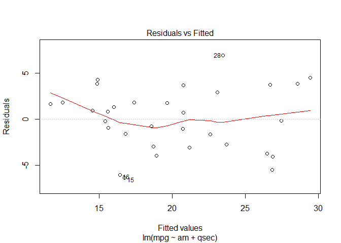
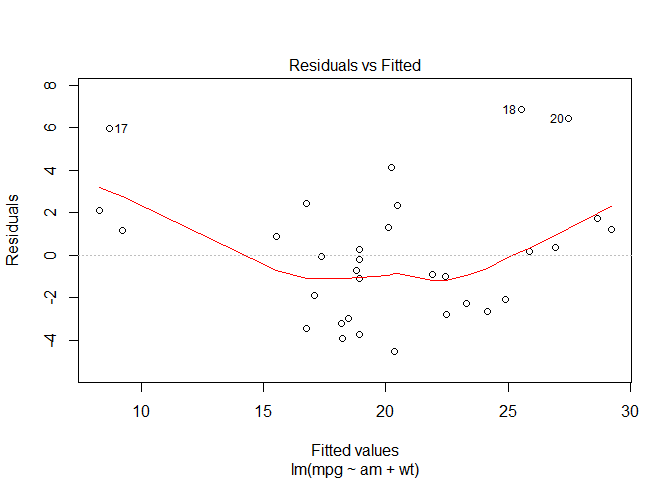

# regmods-006_project scratch work

## Preliminaries


```r
library("Hmisc")
library("MASS")
library("car")
library("dplyr")
library("ggplot2")
library("GGally")
```

This is a suite of diagnostics that one can run on model fits, so I might as well package them up in a function.


```r
dfit <- function(fit, summary = TRUE, ANOVA = TRUE,
                 outlierTest = TRUE, QQ = TRUE, leveragePlots = TRUE, Cook = TRUE,
                 influencePlot = TRUE,
                 ncvTest = TRUE, residualPlots = TRUE,
                 ResidFitted = TRUE, ScaleLocation = TRUE, ResidLeverage = TRUE,
                 vif = TRUE) {
    ## SUMMARY ##
    if (summary) {
        print("SUMMARY:")
        print(summary(fit))
    }
    if (ANOVA) {
        print("ANOVA:")
        print(anova(fit))
    }
    
    ## OUTLIERS, INFLUENCE, AND LEVERAGE ##
    if (outlierTest) {
        print("OUTLIER TEST:")
        print(outlierTest(fit))
    }
    if (QQ) {
        plot(fit, which = 2)
    }
    if (leveragePlots) {
        print(leveragePlots(fit, main = "Leverage Plots"))
    }
    if (Cook) {
        cutoff <- 4/((nrow(fit$model)-length(fit$coefficients)-2)) # D > 4/(n-k-1)  
        plot(fit, which=4, cook.levels=cutoff) # Cook's Distance
    }
    if (influencePlot) {
        print(influencePlot(fit, main="Influence Plot",
                            sub="Circle size is proportial to Cook's Distance"))
    }

    
    ## RESIDUALS AND HOMOSKEDASTICITY ##
    if (ncvTest) {
        print("NCV TEST:")
        print(ncvTest(fit))
    }
    if (residualPlots) {
        print(residualPlots(fit, main = "Residual Plots:"))
    }
    if (ResidFitted) {
        plot(fit, which = 1)
    }
    if (ScaleLocation) {
        plot(fit, which = 3)
    }
    if (ResidLeverage) {
        plot(fit, which = 5)
    }
    
    ## MULTICOLLINEARITY ##
    if (vif) {
        print("VIF:")
        print(vif(fit))
    }
}
```

Convert factor variables.

```r
mtcars2 <- mtcars %>%
    mutate(cyl = factor(cyl),
           vs = factor(vs, levels = c(0, 1), labels = c("V", "S")),
           am = factor(am, levels = c(0, 1), labels = c("Automatic", "Manual")),
           gear = factor(gear, levels = c(3, 4, 5)))
```

## EDA

Basic summary:

```r
mpg_by_am <- mtcars2 %>%
    group_by(am) %>%
    summarise(mean(mpg), sd(mpg))
mpg_by_am
```

```
## Source: local data frame [2 x 3]
## 
##          am mean(mpg) sd(mpg)
## 1 Automatic     17.15   3.834
## 2    Manual     24.39   6.167
```

```r
ggplot(data = mtcars2, aes(x = am, y = mpg)) +
    geom_boxplot() +
    xlab("Transmission") +
    ylab("MPG")
```

 

Scatterplot matrices with correlation tables.

(Note. Significant when $|r| > 0.349$.)


```r
mtcars_num <- mtcars2 %>%
    select(mpg, disp, hp, drat, wt, qsec, carb)
mtcars_cat <- mtcars2 %>%
    select(mpg, wt, cyl, vs, am, gear)
ggpairs(mtcars_num)
```

 

```r
ggpairs(mtcars_cat)
```

 

(Note that our factor variables are all associated with weight as well.)


## mpg ~ am

(This is just one-way ANOVA with two categories, which is really just a two-sample t-test.)


```r
fit1 <- lm(mpg ~ am, data = mtcars2)
dfit(fit1, vif = FALSE)
```

```
## [1] "SUMMARY:"
## 
## Call:
## lm(formula = mpg ~ am, data = mtcars2)
## 
## Residuals:
##    Min     1Q Median     3Q    Max 
## -9.392 -3.092 -0.297  3.244  9.508 
## 
## Coefficients:
##             Estimate Std. Error t value Pr(>|t|)    
## (Intercept)    17.15       1.12   15.25  1.1e-15 ***
## amManual        7.24       1.76    4.11  0.00029 ***
## ---
## Signif. codes:  0 '***' 0.001 '**' 0.01 '*' 0.05 '.' 0.1 ' ' 1
## 
## Residual standard error: 4.9 on 30 degrees of freedom
## Multiple R-squared:  0.36,	Adjusted R-squared:  0.338 
## F-statistic: 16.9 on 1 and 30 DF,  p-value: 0.000285
## 
## [1] "ANOVA:"
## Analysis of Variance Table
## 
## Response: mpg
##           Df Sum Sq Mean Sq F value  Pr(>F)    
## am         1    405     405    16.9 0.00029 ***
## Residuals 30    721      24                    
## ---
## Signif. codes:  0 '***' 0.001 '**' 0.01 '*' 0.05 '.' 0.1 ' ' 1
## [1] "OUTLIER TEST:"
## 
## No Studentized residuals with Bonferonni p < 0.05
## Largest |rstudent|:
##    rstudent unadjusted p-value Bonferonni p
## 20    2.135            0.04133           NA
```

  

```
## [1] 0
```

  

```
##    StudRes     Hat  CookD
## 1  -0.7144 0.07692 0.1470
## 20  2.1351 0.07692 0.4121
## [1] "NCV TEST:"
## Non-constant Variance Score Test 
## Variance formula: ~ fitted.values 
## Chisquare = 3.41    Df = 1     p = 0.06481
```

```
## Warning: No possible lack-of-fit tests
```

 

```
## [1] "No possible lack-of-fit tests"
```

   

Equivalent to a two-sample t-test with equal variances assumed. ($F = t^{2}$.)


```r
fit_t1 <- t.test(mpg ~ am, var.equal = TRUE, data = mtcars2)
fit_t1
```

```
## 
## 	Two Sample t-test
## 
## data:  mpg by am
## t = -4.106, df = 30, p-value = 0.000285
## alternative hypothesis: true difference in means is not equal to 0
## 95 percent confidence interval:
##  -10.848  -3.642
## sample estimates:
## mean in group Automatic    mean in group Manual 
##                   17.15                   24.39
```

```r
all.equal(anova(fit1)$F[1], (fit_t1$statistic)^2, check.attributes = FALSE)
```

```
## [1] TRUE
```

It is more correct, however, to perform Welch's t-test:


```r
fit_t2 <- t.test(mpg ~ am, data = mtcars2)
fit_t2
```

```
## 
## 	Welch Two Sample t-test
## 
## data:  mpg by am
## t = -3.767, df = 18.33, p-value = 0.001374
## alternative hypothesis: true difference in means is not equal to 0
## 95 percent confidence interval:
##  -11.28  -3.21
## sample estimates:
## mean in group Automatic    mean in group Manual 
##                   17.15                   24.39
```

## mpg ~ .


```r
fit_all <- lm(mpg ~ ., data = mtcars2)
dfit(fit_all)
```

```
## [1] "SUMMARY:"
## 
## Call:
## lm(formula = mpg ~ ., data = mtcars2)
## 
## Residuals:
##    Min     1Q Median     3Q    Max 
## -3.202 -1.232  0.103  1.195  4.308 
## 
## Coefficients:
##             Estimate Std. Error t value Pr(>|t|)  
## (Intercept)  15.0926    17.1363    0.88    0.389  
## cyl6         -1.1994     2.3874   -0.50    0.621  
## cyl8          3.0549     4.8299    0.63    0.535  
## disp          0.0126     0.0177    0.71    0.487  
## hp           -0.0571     0.0317   -1.80    0.088 .
## drat          0.7358     1.9846    0.37    0.715  
## wt           -3.5451     1.9090   -1.86    0.079 .
## qsec          0.7680     0.7522    1.02    0.320  
## vsS           2.4885     2.5401    0.98    0.340  
## amManual      3.3474     2.2895    1.46    0.160  
## gear4        -0.9992     2.9466   -0.34    0.738  
## gear5         1.0645     3.0273    0.35    0.729  
## carb          0.7870     1.0360    0.76    0.457  
## ---
## Signif. codes:  0 '***' 0.001 '**' 0.01 '*' 0.05 '.' 0.1 ' ' 1
## 
## Residual standard error: 2.62 on 19 degrees of freedom
## Multiple R-squared:  0.885,	Adjusted R-squared:  0.812 
## F-statistic: 12.1 on 12 and 19 DF,  p-value: 1.76e-06
## 
## [1] "ANOVA:"
## Analysis of Variance Table
## 
## Response: mpg
##           Df Sum Sq Mean Sq F value Pr(>F)    
## cyl        2    825     412   60.25  6e-09 ***
## disp       1     58      58    8.42 0.0091 ** 
## hp         1     19      19    2.70 0.1166    
## drat       1     12      12    1.74 0.2027    
## wt         1     56      56    8.15 0.0101 *  
## qsec       1      2       2    0.22 0.6423    
## vs         1      0       0    0.04 0.8358    
## am         1     17      17    2.42 0.1363    
## gear       2      5       3    0.37 0.6977    
## carb       1      4       4    0.58 0.4568    
## Residuals 19    130       7                   
## ---
## Signif. codes:  0 '***' 0.001 '**' 0.01 '*' 0.05 '.' 0.1 ' ' 1
## [1] "OUTLIER TEST:"
## 
## No Studentized residuals with Bonferonni p < 0.05
## Largest |rstudent|:
##    rstudent unadjusted p-value Bonferonni p
## 17     2.12            0.04816           NA
```

   

```
## [1] 0
```

  

```
##    StudRes    Hat  CookD
## 9  -0.8177 0.7836 0.4353
## 17  2.1201 0.3196 0.3704
## 29 -1.6622 0.7093 0.6888
## [1] "NCV TEST:"
## Non-constant Variance Score Test 
## Variance formula: ~ fitted.values 
## Chisquare = 0.6808    Df = 1     p = 0.4093
```

  

```
##            Test stat Pr(>|t|)
## cyl               NA       NA
## disp           1.407    0.176
## hp             0.794    0.438
## drat          -1.241    0.231
## wt             1.441    0.167
## qsec          -0.813    0.427
## vs                NA       NA
## am                NA       NA
## gear              NA       NA
## carb           0.403    0.691
## Tukey test     3.030    0.002
```

   

```
## [1] "VIF:"
##        GVIF Df GVIF^(1/(2*Df))
## cyl  44.447  2           2.582
## disp 21.894  1           4.679
## hp   21.456  1           4.632
## drat  5.100  1           2.258
## wt   15.801  1           3.975
## qsec  8.183  1           2.861
## vs    7.423  1           2.725
## am    5.911  1           2.431
## gear 25.668  2           2.251
## carb 12.681  1           3.561
```

## mpg ~ am + qsec


```r
fit2 <- lm(mpg ~ am + qsec, data = mtcars2)
dfit(fit2)
```

```
## [1] "SUMMARY:"
## 
## Call:
## lm(formula = mpg ~ am + qsec, data = mtcars2)
## 
## Residuals:
##    Min     1Q Median     3Q    Max 
## -6.345 -2.770  0.294  2.095  6.919 
## 
## Coefficients:
##             Estimate Std. Error t value Pr(>|t|)    
## (Intercept)   -18.89       6.60   -2.86   0.0077 ** 
## amManual        8.88       1.29    6.88  1.5e-07 ***
## qsec            1.98       0.36    5.50  6.3e-06 ***
## ---
## Signif. codes:  0 '***' 0.001 '**' 0.01 '*' 0.05 '.' 0.1 ' ' 1
## 
## Residual standard error: 3.49 on 29 degrees of freedom
## Multiple R-squared:  0.687,	Adjusted R-squared:  0.665 
## F-statistic: 31.8 on 2 and 29 DF,  p-value: 4.88e-08
## 
## [1] "ANOVA:"
## Analysis of Variance Table
## 
## Response: mpg
##           Df Sum Sq Mean Sq F value  Pr(>F)    
## am         1    405     405    33.3 3.0e-06 ***
## qsec       1    368     368    30.3 6.3e-06 ***
## Residuals 29    353      12                    
## ---
## Signif. codes:  0 '***' 0.001 '**' 0.01 '*' 0.05 '.' 0.1 ' ' 1
## [1] "OUTLIER TEST:"
## 
## No Studentized residuals with Bonferonni p < 0.05
## Largest |rstudent|:
##    rstudent unadjusted p-value Bonferonni p
## 28    2.201            0.03618           NA
```

  

```
## [1] 0
```

  

```
##    StudRes     Hat  CookD
## 9   -1.271 0.28993 0.4640
## 28   2.201 0.07918 0.3501
## [1] "NCV TEST:"
## Non-constant Variance Score Test 
## Variance formula: ~ fitted.values 
## Chisquare = 1.258    Df = 1     p = 0.2619
```

 

```
##            Test stat Pr(>|t|)
## am                NA       NA
## qsec          -1.216    0.234
## Tukey test     1.382    0.167
```

   

```
## [1] "VIF:"
##    am  qsec 
## 1.056 1.056
```

## mpg ~ am + wt


```r
fit3 <- lm(mpg ~ am + wt, data = mtcars2)
dfit(fit3)
```

```
## [1] "SUMMARY:"
## 
## Call:
## lm(formula = mpg ~ am + wt, data = mtcars2)
## 
## Residuals:
##    Min     1Q Median     3Q    Max 
## -4.530 -2.362 -0.132  1.403  6.878 
## 
## Coefficients:
##             Estimate Std. Error t value Pr(>|t|)    
## (Intercept)  37.3216     3.0546   12.22  5.8e-13 ***
## amManual     -0.0236     1.5456   -0.02     0.99    
## wt           -5.3528     0.7882   -6.79  1.9e-07 ***
## ---
## Signif. codes:  0 '***' 0.001 '**' 0.01 '*' 0.05 '.' 0.1 ' ' 1
## 
## Residual standard error: 3.1 on 29 degrees of freedom
## Multiple R-squared:  0.753,	Adjusted R-squared:  0.736 
## F-statistic: 44.2 on 2 and 29 DF,  p-value: 1.58e-09
## 
## [1] "ANOVA:"
## Analysis of Variance Table
## 
## Response: mpg
##           Df Sum Sq Mean Sq F value  Pr(>F)    
## am         1    405     405    42.2 4.1e-07 ***
## wt         1    443     443    46.1 1.9e-07 ***
## Residuals 29    278      10                    
## ---
## Signif. codes:  0 '***' 0.001 '**' 0.01 '*' 0.05 '.' 0.1 ' ' 1
## [1] "OUTLIER TEST:"
## 
## No Studentized residuals with Bonferonni p < 0.05
## Largest |rstudent|:
##    rstudent unadjusted p-value Bonferonni p
## 18    2.519            0.01777       0.5685
```

  

```
## [1] 0
```

  

```
##    StudRes     Hat  CookD
## 16  0.7715 0.22998 0.2451
## 17  2.3425 0.21345 0.6556
## 18  2.5188 0.07981 0.3935
## [1] "NCV TEST:"
## Non-constant Variance Score Test 
## Variance formula: ~ fitted.values 
## Chisquare = 0.03582    Df = 1     p = 0.8499
```

 

```
##            Test stat Pr(>|t|)
## am                NA       NA
## wt             3.557    0.001
## Tukey test     3.555    0.000
```

   

```
## [1] "VIF:"
##    am    wt 
## 1.921 1.921
```

## mpg ~ am + wt + qsec

Recommended by `stepAIC`.


```r
fit4 <- lm(mpg ~ am + wt + qsec, data = mtcars2)
dfit(fit4)
```

```
## [1] "SUMMARY:"
## 
## Call:
## lm(formula = mpg ~ am + wt + qsec, data = mtcars2)
## 
## Residuals:
##    Min     1Q Median     3Q    Max 
## -3.481 -1.556 -0.726  1.411  4.661 
## 
## Coefficients:
##             Estimate Std. Error t value Pr(>|t|)    
## (Intercept)    9.618      6.960    1.38  0.17792    
## amManual       2.936      1.411    2.08  0.04672 *  
## wt            -3.917      0.711   -5.51    7e-06 ***
## qsec           1.226      0.289    4.25  0.00022 ***
## ---
## Signif. codes:  0 '***' 0.001 '**' 0.01 '*' 0.05 '.' 0.1 ' ' 1
## 
## Residual standard error: 2.46 on 28 degrees of freedom
## Multiple R-squared:  0.85,	Adjusted R-squared:  0.834 
## F-statistic: 52.7 on 3 and 28 DF,  p-value: 1.21e-11
## 
## [1] "ANOVA:"
## Analysis of Variance Table
## 
## Response: mpg
##           Df Sum Sq Mean Sq F value  Pr(>F)    
## am         1    405     405    67.0 6.5e-09 ***
## wt         1    443     443    73.2 2.7e-09 ***
## qsec       1    109     109    18.0 0.00022 ***
## Residuals 28    169       6                    
## ---
## Signif. codes:  0 '***' 0.001 '**' 0.01 '*' 0.05 '.' 0.1 ' ' 1
## [1] "OUTLIER TEST:"
## 
## No Studentized residuals with Bonferonni p < 0.05
## Largest |rstudent|:
##    rstudent unadjusted p-value Bonferonni p
## 17    2.323            0.02795       0.8944
```

  

```
## [1] 0
```

  

```
##    StudRes    Hat  CookD
## 9   -1.251 0.2970 0.4026
## 17   2.323 0.2296 0.5896
## [1] "NCV TEST:"
## Non-constant Variance Score Test 
## Variance formula: ~ fitted.values 
## Chisquare = 1.558    Df = 1     p = 0.2119
```

 

```
##            Test stat Pr(>|t|)
## am                NA       NA
## wt             2.816    0.009
## qsec          -1.565    0.129
## Tukey test     3.227    0.001
```

   

```
## [1] "VIF:"
##    am    wt  qsec 
## 2.541 2.483 1.364
```

Note that we have improvement in model fit for all steps except the last.

```r
anova(fit1, fit3, fit4, fit_all)
```

```
## Analysis of Variance Table
## 
## Model 1: mpg ~ am
## Model 2: mpg ~ am + wt
## Model 3: mpg ~ am + wt + qsec
## Model 4: mpg ~ cyl + disp + hp + drat + wt + qsec + vs + am + gear + carb
##   Res.Df RSS Df Sum of Sq     F  Pr(>F)    
## 1     30 721                               
## 2     29 278  1       443 64.66 1.6e-07 ***
## 3     28 169  1       109 15.93 0.00078 ***
## 4     19 130  9        39  0.64 0.75244    
## ---
## Signif. codes:  0 '***' 0.001 '**' 0.01 '*' 0.05 '.' 0.1 ' ' 1
```

```r
anova(fit1, fit2, fit4, fit_all)
```

```
## Analysis of Variance Table
## 
## Model 1: mpg ~ am
## Model 2: mpg ~ am + qsec
## Model 3: mpg ~ am + wt + qsec
## Model 4: mpg ~ cyl + disp + hp + drat + wt + qsec + vs + am + gear + carb
##   Res.Df RSS Df Sum of Sq     F  Pr(>F)    
## 1     30 721                               
## 2     29 353  1       368 53.80 5.9e-07 ***
## 3     28 169  1       183 26.79 5.4e-05 ***
## 4     19 130  9        39  0.64    0.75    
## ---
## Signif. codes:  0 '***' 0.001 '**' 0.01 '*' 0.05 '.' 0.1 ' ' 1
```
